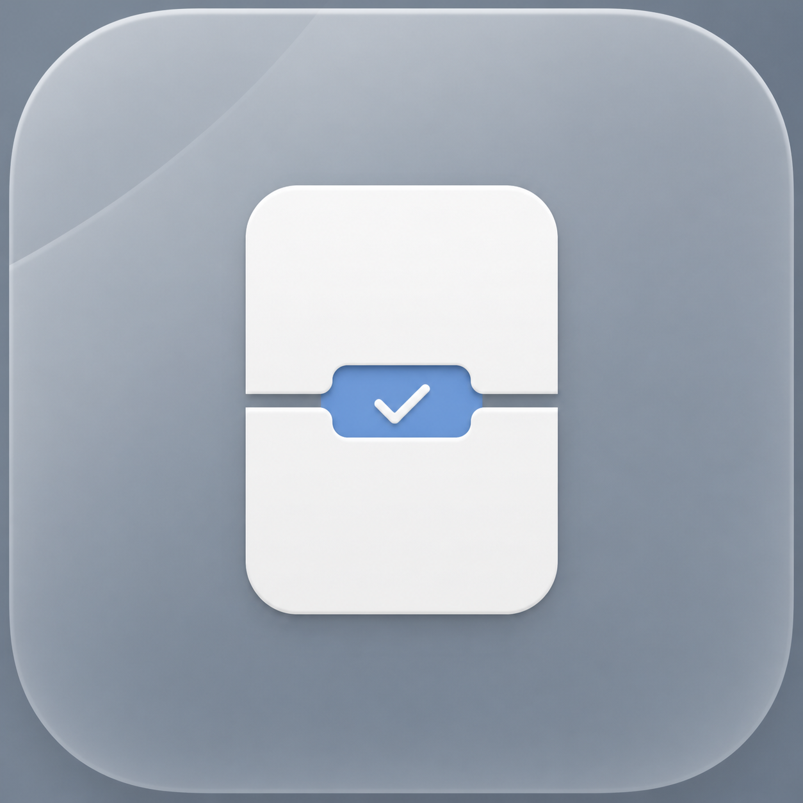
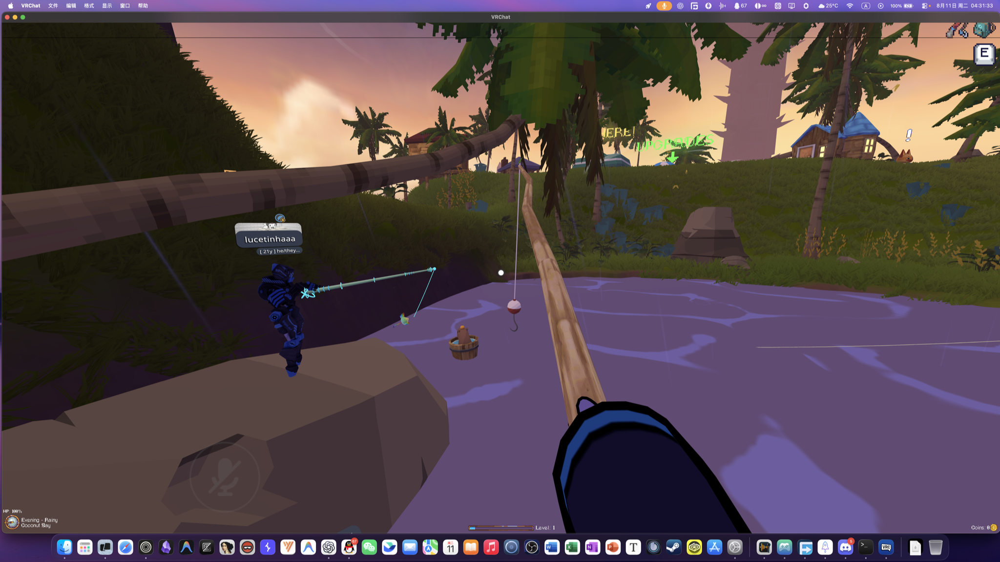
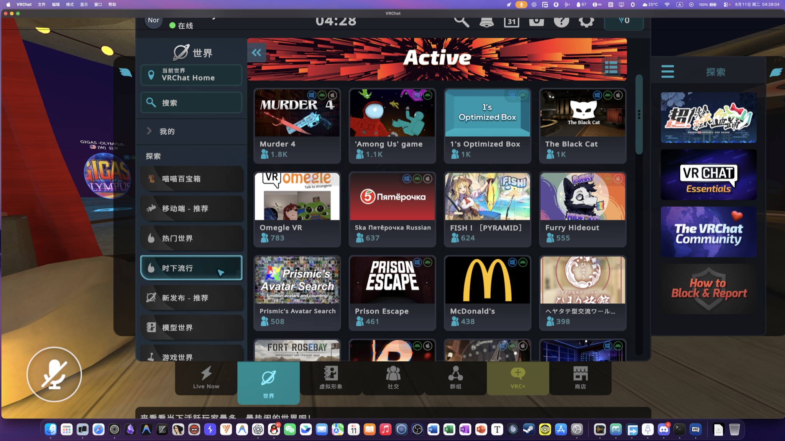

# PlayCover VRChat Patcher

<p align="center">
  
</p>

<p align="center">
  <strong>让你在 Mac 上通过 PlayCover 正常游玩 VRChat</strong>
</p>

<p align="center">
  免费、开源的兼容补丁工具，支持已验证的 PlayCover 和 VRChat 版本，
  不修改官方 PlayCover。
</p>

<p align="center">
  <a href="./README.md">English</a>
</p>

<p align="center">
  
  
  
  
</p>

---

## 功能

- 保留 `/Applications/PlayCover.app` 不变。
- 创建独立的 `/Applications/PlayCover VRChat.app` 和游戏库。
- 导入并验证受支持版本的 VRChat。
- 启动 VRChat 时临时应用内存 soft limit。
- 支持自动使用 75% 内存，或手动选择整 GiB 上限。

界面流程受 [CXPatcher](https://github.com/italomandara/CXPatcher) 启发，
补丁事务、验证逻辑和 controller 均为本项目独立实现。

## 工作原理

1. Patcher 将官方 PlayCover 复制为独立应用和独立游戏库。
2. 导入经过验证的 VRChat，不修改 VRChat，也不注入 dylib。
3. 启动 VRChat 时，定制版 PlayCover 请求已授权的 controller 等待这个精确进程。
4. controller 应用 non-fatal 内存 soft limit，并在运行期间修复已知的
   RunningBoard 重置。
5. 这个精确进程退出后，临时策略自动清理。

VRChat 启动路径不会使用 PlayTools，因为它的注入可能导致完整性检查失败。
移除冲突后，检查可以正常通过。内存策略只改变系统报告的上限，不会预先占用 RAM。

在当前锁定的 VRChat 版本中，T5/T6 对照显示：非零内存语义是远程头像和模型
AssetBundle 加载路径正常工作的必要条件之一。这是当前兼容版本的实测结论，
不代表所有未来版本。

## 已安装 controller 的原理

`.pkg` 会安装一个 root-owned runner 和一个固定用途的 controller。它不是 daemon，
也不会修改内核。需要启动时，controller 使用 macOS XNU 的
`memorystatus_control` 接口，为精确的 VRChat 进程设置临时内存上限。
底层使用 `MEMORYSTATUS_CMD_SET_MEMLIMIT_PROPERTIES`，然后回读策略确认生效。

它根据 `hw.memsize` 计算安全上限，检查 VRChat 身份和当前 arm64 主机能力，等待目标进程，
回读策略并修复已知的 RunningBoard 重置。VRChat 退出后策略自动移除。任何身份、
内存压力或策略不匹配都会安全停止，不会操作其他进程。

macOS 的 build/XNU 字符串只作为测试记录，不再作为运行锁；真正的策略写入、回读、
VRChat 身份和运行时映像检查仍然失败即停止。

日志中的可用余量是动态值：选择的上限减去当前 footprint。controller 不伪造
内存 API 返回值，不 Hook Unity，也不修改 Appdome 或 `libloader`；它只在游戏外
应用真实的 XNU 策略。

## 快速开始

### 当前测试基线

- Apple silicon Mac
- macOS 26.6 / build `25G70`（测试基线，不是运行锁）
- PlayCover `3.1.0 (856)`
- VRChat `2026.2.30300 (1365)`

PlayCover 和 VRChat 身份仍然严格匹配；arm64 主机会通过实时策略写入和回读检查，
不会因为 macOS point release 的 build/XNU 字符串变化而直接拒绝。

### 首次启动

1. 在原版 PlayCover 中打开 VRChat 设置：

```text
Settings → Misc → Remove PlayTools
```

PlayTools 可能导致完整性检查失败。移除它后，冲突的注入消失，完整性检查即可
正常通过。但 VRChat 可能一直认为可用内存是 `0 MB`。在当前版本的 T5 对照中，
这个零内存状态会阻止远程头像/模型加载；T6 的非零策略可以让该路径继续运行。

2. 打开 **PlayCover VRChat Patcher**。
3. 将官方 `PlayCover.app` 拖入窗口，或手动选择。
4. 点击 **创建补丁副本**，按提示完成 macOS 安装授权。
5. 从 `/Applications` 打开 **PlayCover VRChat**，再正常启动 VRChat。

定制版会保持 PlayTools 对 VRChat 关闭，并在启动前应用内存策略。首次设置可能
需要管理员授权；工具不会读取或保存密码。

## 实机测试

<p align="center">
  
  
</p>

## 内存设置

在 **PlayCover VRChat** 中打开 VRChat 设置，选择 **VRChat 内存**。

- **自动**：使用物理内存的 75%，向下取整到整 GiB。
- **自定义**：可在 4 GiB 到安全上限之间按 1 GiB 调整。
- 这是 non-fatal soft limit，不是预先占用内存。
- 修改会在下一次启动时生效。

## 文件与数据

| 项目 | 路径 |
| --- | --- |
| 官方 PlayCover | `/Applications/PlayCover.app` |
| 定制 PlayCover | `/Applications/PlayCover VRChat.app` |
| 独立游戏库 | `~/Library/Containers/io.github.northstarxyzz.PlayCoverVRChat` |
| 共享 VRChat 用户数据 | `~/Library/Containers/com.vrchat.mobile` |

Patch、Repair 和 Remove 不会删除官方应用或官方游戏库。

## 限制

- 当前是锁定版本的开发者 Alpha，不是通用 PlayCover 发行版。
- 不支持的 PlayCover、VRChat、macOS 或架构会安全停止。
- 不要使用未审阅的 CI artifact 或修改过的 payload。
- 目前还没有公开签名和公证版本。

## 从源码构建

```zsh
swift test -c release
/bin/zsh PlayCoverPatch/run-tests.sh
swift build -c release --product PlayCoverVRChatPatcher
```

构建仅用于检查的 source-only 应用：

```zsh
/bin/zsh Scripts/build-patcher-app.sh \
  --output "$PWD/Artifacts/PlayCover VRChat Patcher.app"
```

带 payload 的构建需要单独审阅的 PlayCover payload 和 manifest。完整流程见
[Docs/DEVELOPMENT.md](Docs/DEVELOPMENT.md)。

## 仓库结构

```text
Patcher/          SwiftUI Patcher 与安装事务
PlayCoverPatch/   可审阅的 PlayCover 补丁序列
Controller/       VRChat 内存策略 controller 与安装包
Compatibility/    版本和身份 manifest
Scripts/          构建与验证脚本
Docs/             开发和发布说明
```

## 开源协议

本项目使用 [GPL-3.0-only](LICENSE) 发布。第三方声明见
[THIRD_PARTY_NOTICES.md](THIRD_PARTY_NOTICES.md)。
